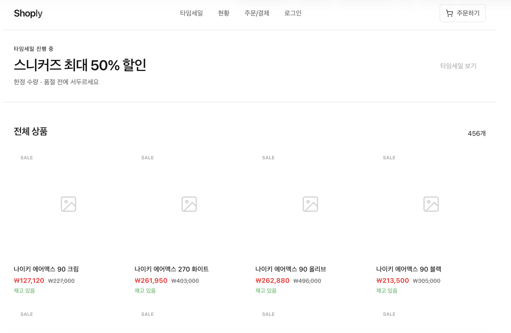
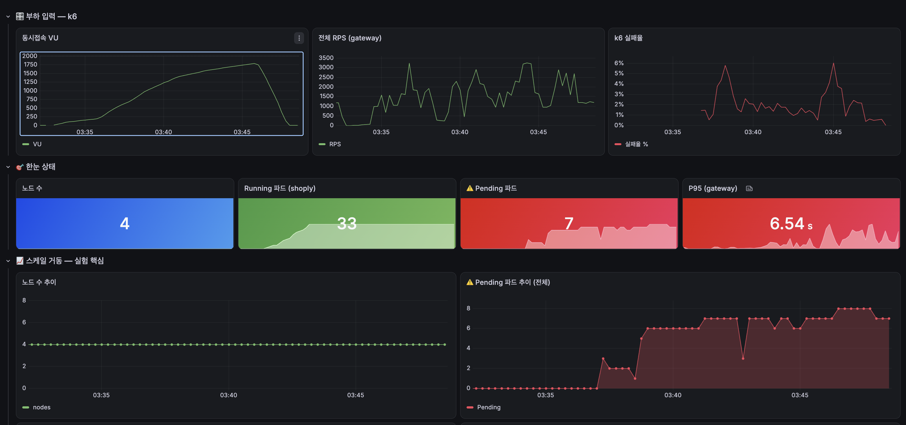

# when-nodes-run-out

> 동일한 앱, 동일한 트래픽, 다른 인프라 — 데이터가 말하게 한다.

온프레미스 Kubernetes와 AWS EKS에 **동일한 쇼핑몰 MSA 앱**을 똑같이 배포하고, **노드 자동확장 유무** 하나만 다르게 두어 트래픽 폭증·노드 장애 상황에서 두 인프라가 어떻게 다르게 버티는지 데이터로 비교하는 실험 프로젝트입니다.

이 레포는 5인 팀 프로젝트 중 **제가 실제로 만들고 운영한 부분**(앱 개발, 온프레미스 인프라 구축, 공용 인프라 일부)을 정리한 것입니다. 팀 전체 역할 분담은 [`docs/project-roles.md`](docs/project-roles.md)에 있습니다.



## 왜 만들었나

이커머스 타임세일처럼 트래픽이 순간 폭증하는 상황에서, "자체 인프라(온프레미스)"와 "클라우드 관리형(EKS)"이 실제로 얼마나 다르게 버티는지 막연한 통념이 아니라 숫자로 확인하고 싶었습니다. 앱·부하·설정을 전부 동일하게 맞추고 딱 하나(노드 자동확장)만 다르게 두는 대조 실험으로 설계했습니다.

## 실제로 확인한 것

온프레미스에 부하를 계속 올린 결과, 고정 자원의 한계에 도달하는 순간을 실제로 관측했습니다 — 노드 수는 4개로 고정된 채 동시접속이 2000명까지 올라가자 **Pending 파드가 0→7개까지 쌓이고, P95 레이턴시 6.54초, k6 실패율 최대 6%**까지 치솟았습니다.



자세한 실험 설계와 결과는 [`docs/experiments.md`](docs/experiments.md)에 정리했습니다. (EKS 쪽 구축·비교는 팀원 담당이라 진행 중입니다.)

## 아키텍처

```
사용자 → EC2(iptables DNAT) → KVM master/worker(k8s) → Nginx Ingress → MSA 서비스 7개
                                                                          ↓
                                              PostgreSQL / Redis (별도 EC2, 공용)
                                                                          ↓
                                          Prometheus / Grafana / Loki (모니터링, 별도 EC2)
```

온프레미스는 EC2 위 KVM 가상머신 4대(master + worker1/2 실험용 + worker3 운영격리)로 물리 클러스터를 재현했습니다. 자세한 구성은 [`docs/homogenization.md`](docs/homogenization.md)와 `onprem` 브랜치의 README를 참고하세요.

## 기술 스택

| 영역 | 스택 |
|---|---|
| 백엔드 | Node.js 22, Express, TypeScript |
| 프론트엔드 | React 19, TanStack Router, Tailwind CSS v4 |
| 인프라 | Kubernetes(kubeadm) on KVM, Docker |
| DB/캐시 | PostgreSQL 16, Redis 7 |
| 모니터링 | Prometheus, Grafana, Loki |
| 부하테스트 | k6 |
| CI/CD | GitHub Actions → GHCR |

## 브랜치 구조

작업은 컴포넌트별 브랜치에서 진행 후 `develop`에서 통합 테스트, 이상 없으면 `main`으로 병합합니다.

| 브랜치 | 내용 |
|---|---|
| `app` | 쇼핑몰 MSA 서비스 코드(gateway/product/inventory/order/payment/user/frontend) + CI/CD |
| `onprem` | 온프레미스 k8s 매니페스트, 배포/복원 스크립트, 트러블슈팅 기록 |
| `공용` | monitoring(Prometheus/Grafana/Loki), k6 부하테스트, PostgreSQL, Redis, EC2 부트스트랩 |
| `develop` | 위 브랜치들을 통합해 테스트하는 브랜치 |
| `main` | 안정화된 결과물(지금 보고 있는 브랜치) |

각 컴포넌트의 상세 설명(설계 결정, 트러블슈팅, 실행법)은 해당 브랜치의 README.md를 참고하세요.

## 문서

- [프로젝트 역할](docs/project-roles.md) — 팀 구성과 담당 범위
- [환경 동일화 기준](docs/homogenization.md) — 온프레/EKS를 공정하게 비교하기 위한 통제변수·독립변수 정리
- [실험 설계 및 결과](docs/experiments.md) — 시나리오 1/2/3 설계와 진행 상황
