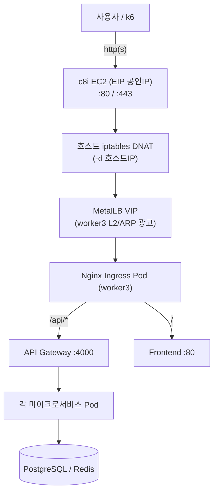
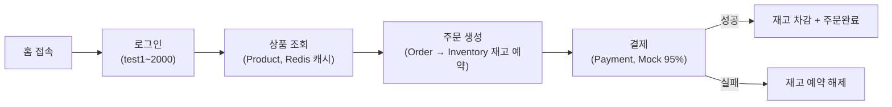
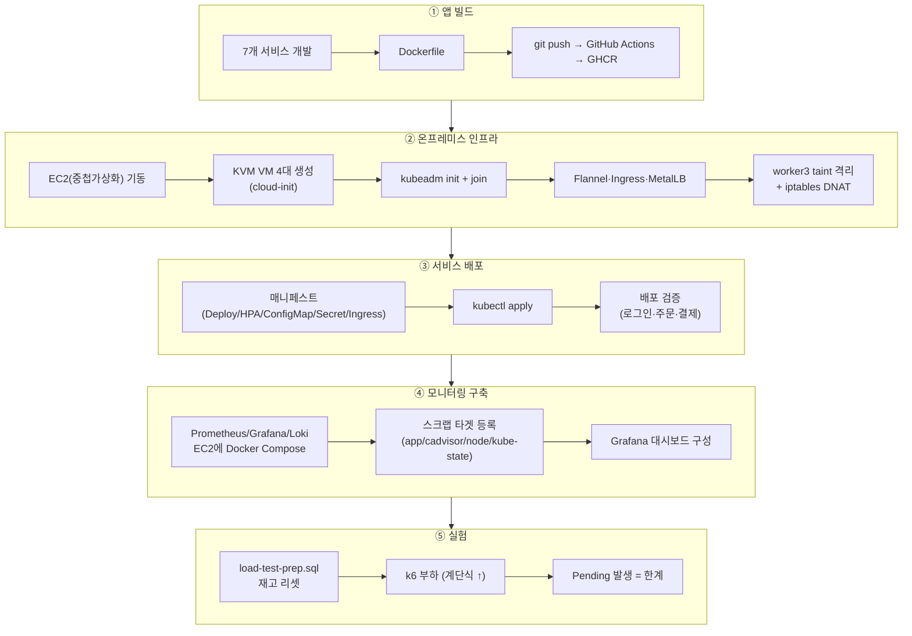
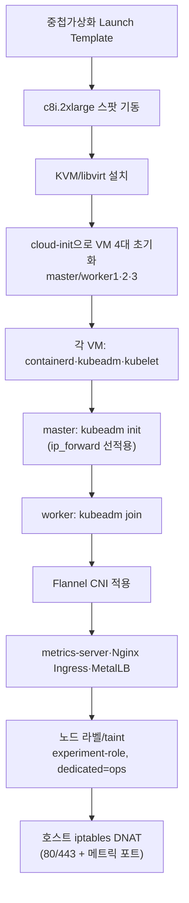
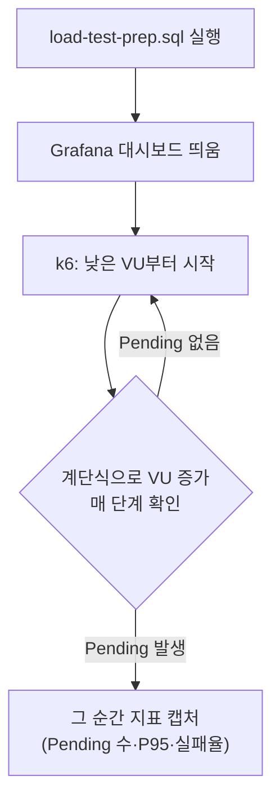
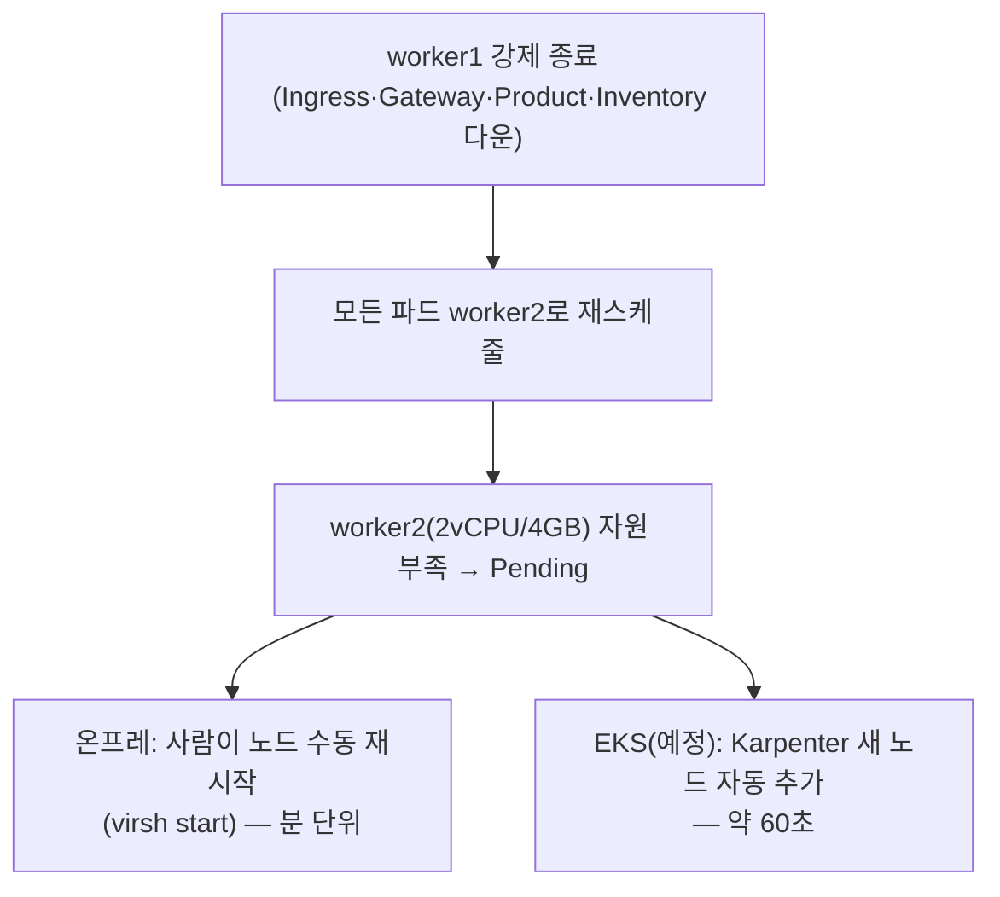
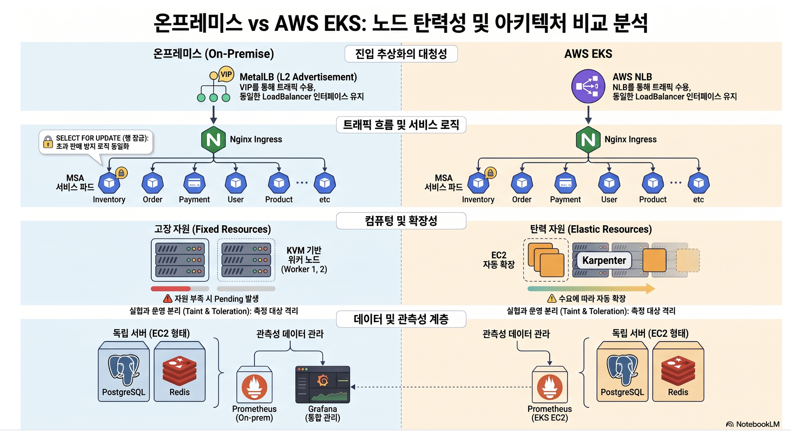
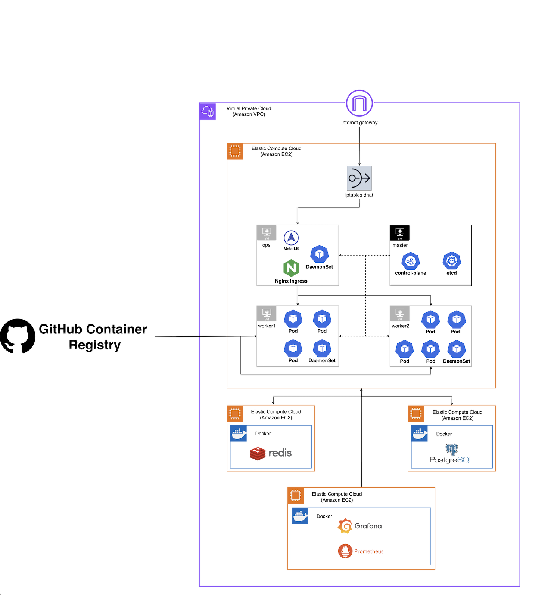
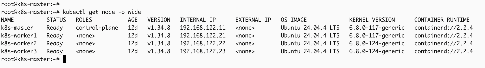
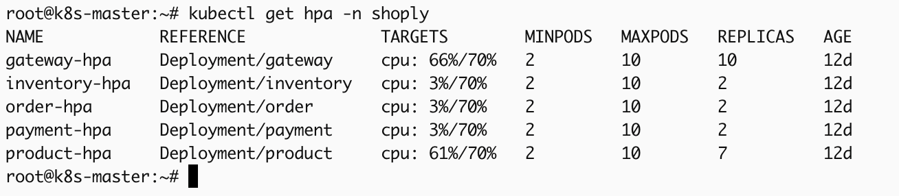

# when-nodes-run-out — 통합 브랜치 (develop)

## 프로젝트 개요

> 동일한 앱, 동일한 트래픽, 다른 인프라 — 데이터가 말하게 한다.

온프레미스 Kubernetes와 AWS EKS에 **동일한 쇼핑몰 MSA 앱**을 똑같이 배포하고, **노드 자동확장 유무** 하나만 다르게 두어 트래픽 폭증·노드 장애 상황에서 두 인프라가 어떻게 다르게 버티는지 데이터로 비교하는 실험 프로젝트입니다.

이커머스 타임세일처럼 트래픽이 순간 폭증하는 상황에서, "자체 인프라(온프레미스)"와 "클라우드 관리형(EKS)"이 실제로 얼마나 다르게 버티는지 막연한 통념이 아니라 숫자로 확인하고 싶어서 시작했습니다. 앱·부하·k8s 설정은 전부 동일하게 맞추고(통제변수), 온프레미스는 고정 워커, EKS는 Karpenter로 노드를 자동 추가한다는 점만 다르게 둡니다(독립변수). 온프레미스에서 Pending이 쌓이는 것은 실패가 아니라 **측정하려는 현상 그 자체**입니다.


### 확인한 핵심 결과

실제로 온프레미스에 부하를 계속 올려본 결과, 고정 자원의 한계에 도달하는 순간을 관측했습니다. 노드 수는 4개로 고정된 채 동시접속 VU를 0→2000까지 램프업하자 Running 파드가 33개까지 늘었고, 이후 **Pending 파드가 0→7개까지 쌓이면서 P95 레이턴시 6.54초, k6 실패율이 최대 6%**까지 치솟았습니다.


EKS 쪽 구축·비교는 팀원 담당이라 진행 중입니다.

## 팀 구성 및 역할 분담

5명, 2개 팀으로 구성해 동일한 앱·동일 기준으로 두 환경을 각각 구축·실험합니다.

| 팀 | 인원 | 담당 |
|---|---|---|
| **온프레미스 팀** | 본인 | 앱 개발(7개 서비스) · 온프레미스 인프라 구축(KVM·k8s) · 서비스 배포 · **모니터링(Prometheus/Grafana/Loki) 구축·운영** · 실험 설계 및 진행 |
| | 팀원E | 부하 시나리오 설계 · CI/CD 파이프라인 설계 |
| **EKS 팀** | 팀원A, 팀원B | EKS 클러스터 구축(Karpenter, terraform) |

이 레포에는 **본인이 실제로 만들고 운영한 부분**(앱, 온프레미스 인프라, 모니터링, k6 실행·postgres·redis·userdata)이 담겨 있습니다. `terraform`과 EKS 클러스터 구축(`k8s/eks`)은 EKS 팀 담당이라 포함하지 않았습니다.

담당 흐름은 아래와 같습니다.

```
[앱 빌드]        7개 서비스 코드 → Docker 이미지 → GHCR
    ↓
[온프레 인프라]  EC2 → KVM VM 4대 → k8s 클러스터 → 네트워크
    ↓
[서비스 배포]    매니페스트(Deploy/HPA/Ingress) → 클러스터 배포 → 검증
    ↓
[모니터링]      Prometheus/Grafana/Loki 구축 → 대시보드 구성
    ↓
[실험]          시나리오 1/2/3 → 한계·MTTR 측정 → 결과 분석
```

역할의 상세 배경은 [`docs/project-roles.md`](docs/project-roles.md)에 정리했습니다.

## 아키텍처 흐름도

### 사용자 요청 흐름 (트래픽 경로)



KVM VM에 공인 IP가 없어 EC2가 80/443을 받아 MetalLB VIP로 넘기는 **NAT 포워딩 홉이 한 번 더 있습니다**(EKS엔 없음 → 변화율%로 보정). Ingress 이후 라우팅은 `/api/*` → gateway, `/` → frontend로 나뉘고, gateway가 다시 각 서비스로 프록시합니다.

### 쇼핑 플로우 (앱 내부 흐름)



### 엔지니어 작업 흐름 (구축 → 배포 → 실험)



### 인프라 구축 상세 흐름



### 실험 측정 흐름 (한계 RPS 찾기)



| 한계 신호 | 확인 |
|---|---|
| **Pending 발생** ★ | `kubectl get pods --field-selector=status.phase=Pending` |
| 워커 CPU 90%+ | `kubectl top nodes` |
| HPA CURRENT=MAX | `kubectl get hpa` |

> 한계의 정의 = Pending Pod이 처음 뜨는 지점입니다.

### 노드 장애 시나리오 흐름 (시나리오 3)



## 환경 동일화 (온프레 ↔ EKS)

두 환경을 공정하게 비교하려면 무엇을 통제변수로 맞추고 무엇을 독립변수로 남길지 못박아야 합니다. **온프레미스가 기준**이고, EKS는 이 값에 맞춥니다.



| 구분 | 항목 | 값 |
|---|---|---|
| 완전 동일(통제변수) | HPA | target CPU **70%**, min **2** / max **10** (gateway/product/inventory/order/payment) |
| | 리소스 | request 100m / limit 500m (frontend 50m/200m) — request를 작게 둬서 HPA가 민감하게 발동 |
| | K8s 버전 | 1.34 |
| | DB/캐시 | PostgreSQL 16(`max_connections=300`), Redis 7, 앱 pool max 8 |
| | 진입 | Nginx Ingress, NodePort **30080** — ALB/NLB는 트래픽 경로를 오염시키므로 일부러 안 씀 |
| 비슷하게(최대 근접) | 노드 스펙 | 2vCPU/4GB 동일(KVM VM ↔ t3.medium류) |
| | CNI | Flannel(온프레) ↔ AWS VPC CNI(EKS) — 구현은 다르나 측정 대상 아님 |
| 의도적으로 다르게(독립변수) | **노드 자동확장** ★ | **온프레: 고정 워커(안 늘어남) / EKS: Karpenter(자동 추가)** — 유일한 핵심 변수 |
| | 진입 경로 | 온프레는 EC2 iptables DNAT 1홉 추가(VM에 공인 IP 없음) → 응답시간은 절대값이 아닌 변화율(%)로 비교해 상쇄 |

전체 비교표(노드별 배치, 포트 전체, K8s 구성요소 대조, 동일화 검증 명령)는 [`docs/homogenization.md`](docs/homogenization.md)에 있습니다.

## 포트 정리

| 포트 | 위치 | 용도 |
|:---:|---|---|
| 80 / 443 | 온프레 EC2(iptables DNAT) | 외부 진입 → MetalLB VIP |
| 30080 | Nginx Ingress | NodePort 진입(양쪽 동일) |
| 4000~4005 | 앱 컨테이너 | gateway/product/inventory/order/payment/user |
| 30400~30404 | 앱 메트릭 | 서비스별 `/metrics` NodePort |
| 30800 | kube-state-metrics | 파드/노드/Pending 상태 |
| 39101~39103 | node_exporter | 워커별 NodePort |
| 38080/38081 | cAdvisor | worker1/2 (worker3 ops 노드는 toleration으로 추가 배치) |
| 5432 / 6379 | PostgreSQL / Redis | 공용 DB·캐시 EC2 |
| 9187 / 9121 | postgres_exporter / redis_exporter | DB·캐시 메트릭 |
| 9090 / 9091 | Prometheus(온프레) / Prometheus(EKS 전용) | EKS 쪽은 k6 remote-write 수신만 담당 |
| 3000 / 3100 / 3200 | Grafana / Loki / Tempo | 모니터링 스택, Tempo는 OTLP `4317`(gRPC)/`4318`(HTTP)도 사용 |

## app — 쇼핑몰 MSA 서비스 (+ PostgreSQL, Redis)

Express(TypeScript) 서비스 7개 + React 19 프론트엔드(TanStack Router, Tailwind v4, Vite 6). 품질 우선순위는 UI 완성도가 아니라 **실험 재현성·API 로직·DB 정합성**입니다.

| 서비스 | 포트 | 핵심 역할 |
|---|:---:|---|
| gateway | 4000 | 모든 API 진입점. `/api/*`를 각 서비스로 프록시 + Prometheus 메트릭 수집, 프록시 대상이 죽으면 503 즉시 응답 |
| product | 4001 | 상품 목록/상세 조회, Redis 캐시(목록 60초/상세 30초) |
| inventory | 4002 | 재고 관리, **`SELECT FOR UPDATE`로 동시성 제어**(reserve/deduct/release) — 동시 주문 몰림에도 초과판매 방지 |
| order | 4003 | 주문 생성(재고 예약→저장, 트랜잭션), inventory 호출에 5초 타임아웃(노드 장애 시 무한 대기 방지) |
| payment | 4004 | Mock 결제(95% 성공률), 성공 시 재고 차감·실패 시 예약 해제 |
| user | 4005 | 로그인/인증(bcrypt 해시 + JWT) |
| frontend | 80 | React 쇼핑몰 UI — 상품/타임세일/주문/결제/로그인/어드민/통계 |

### API 라우팅 규칙 (게이트웨이 경유)

| 요청 경로 | 대상 서비스 |
|---|---|
| `GET /` | frontend |
| `POST /api/auth/login` | user |
| `GET /api/products`, `GET /api/products/:id` | product |
| `POST /api/inventory/*` | inventory |
| `POST /api/orders` | order |
| `POST /api/payments` | payment |

gateway는 요청 경로를 `/api/{service}` 수준으로 정규화해 Prometheus 라벨 카디널리티를 낮춥니다.

### 설계 결정

- **재고 동시성 — `SELECT FOR UPDATE`**: k6로 동시 주문을 몰아도 재고가 마이너스로 내려가지 않도록 inventory 서비스에서 행 잠금을 사용합니다.
- **DB 페일오버 대응**: `pg.Pool`에 `connectionTimeoutMillis: 5000`·`keepAlive: true` + `pool.on('error', ...)` — idle 커넥션이 끊겨도 프로세스가 죽지 않게, Primary DB가 죽는 노드 장애 시나리오에서 크래시 루프에 안 빠지도록 했습니다.
- **liveness/readiness 분리**: `/livez`(프로세스 생존)와 `/health`(DB까지 확인)를 나눠, DB가 죽었을 때 전체 파드가 재시작 루프에 빠지는 걸 막았습니다.
- **Mock 결제 95% 성공률**: 실제 PG 연동 없이 결제 실패(재고 롤백 포함) 시나리오를 재현하기 위한 선택입니다.
- **Redis 캐시 TTL 차등**: 목록 60초/상세 30초 — 상세는 재고 반영이 더 즉각적이어야 해서 짧게 뒀습니다. 주 사용처는 product 서비스(`allkeys-lru` 정책, `--save ""`로 영속성 끔 — 캐시는 유실돼도 DB에서 재생성되므로).
- **fetch 타임아웃**(order → inventory): 노드 장애로 inventory가 응답하지 않을 때 order가 무한 대기하지 않도록 `AbortSignal.timeout(5000)`을 적용했습니다.

### 데이터 계층

PostgreSQL 16은 테이블마다 소유 서비스가 있는 MSA 구조입니다(`users`→user, `products`→product, `inventory`→inventory, `orders`/`order_items`→order, `payments`→payment). `max_connections=300`으로 파드 다수 × 커넥션풀 합산에 대응합니다. Redis 7은 순수 캐시 용도(`maxmemory 256mb`, `allkeys-lru`)로 주로 product 서비스가 사용합니다. 둘 다 별도 EC2에서 Docker Compose로 운영하며 온프레/EKS 양쪽이 공유하는 통제변수입니다.

이미지는 GitHub Actions(`ci.yml`은 develop/main PR 검증, `cd.yml`은 push 시 GHCR 빌드+푸시, `cd-otel.yml`은 OTel 계측 이미지를 `:otel` 태그로 별도 빌드)로 관리합니다.

## onprem — 온프레미스 인프라



AWS EC2 위 **KVM 가상머신 4대**(master + worker1/2 실험용 + worker3 운영격리)로 물리 온프레미스 k8s를 재현했습니다.

### EC2 구성

| EC2 | 역할 |
|---|---|
| c8i.2xlarge(스팟) | k8s 호스트 — KVM VM 4대 + 호스트 Nginx/iptables |
| PostgreSQL EC2 | DB(Docker, PostgreSQL 16) |
| Redis EC2 | 캐시(Docker, Redis 7) |
| 모니터링 EC2 | Prometheus + Grafana + Loki(Docker Compose) |

### 구축 과정

c8i-flex.2xlarge 스팟 인스턴스는 중첩가상화가 기본 비활성이라, 처음엔 LXD 컨테이너로 구성했다가 launch template를 만들어 중첩가상화를 명시적으로 켜서 KVM을 띄웠습니다. cloud-init으로 VM을 초기화하고 containerd·kubeadm/kubelet/kubectl을 직접 설치(자동화 없이), `kubeadm init` + worker `join`, Flannel v0.26.7, Nginx Ingress(helm) 순으로 구성했습니다. 노드는 `experiment-role` 라벨로 초기 배치를 고정하고(worker1: gateway/product/inventory, worker2: frontend/order/payment/user), worker3에는 `dedicated=ops:NoSchedule` taint를 줘서 모니터링·ingress 같은 운영성 파드를 실험 워커에서 분리했습니다(측정 신뢰도 확보).


> 4개 노드(master + worker1/2/3) 모두 Ready, Ubuntu 24.04.4 + containerd 2.2.4.

### 네트워크

KVM VM은 공인 IP가 없어 호스트 EC2의 iptables DNAT로 외부 트래픽을 포워딩합니다.


> 80/443은 MetalLB VIP로, 앱/노드 메트릭 포트(30400~30404, 39101~39103, 38080/38081)는 각 VM으로 포워딩됩니다.

### 서비스 배포 — k8s 매니페스트

| 리소스 | 역할 |
|---|---|
| Deployment | 파드 정의(이미지, 리소스, 프로브, affinity) |
| Service(ClusterIP/NodePort) | 내부 통신 / 메트릭 scrape 노출 |
| HPA | 자동 확장(5개: gateway/product/inventory/order/payment) |
| ConfigMap | DB/Redis 호스트 등 환경값 — **재구축을 반복하며 여기에 사설 IP를 안 넣으면 파드가 DB에 못 붙는다는 걸 깨달음** |
| Secret | DB 비번, JWT, GHCR 인증 |
| Ingress | Nginx 경로 라우팅(`/api`→gateway, `/`→frontend) |

HPA는 처음엔 replicas 2개 + max를 낮게 제한해뒀는데, 부하를 줘도 파드가 잘 안 늘어서 replicas 1개 시작 + max를 넉넉히 풀어(현재는 min 2/max 10/target 70%로 조정) 노드 한계까지 파드가 늘어나는 걸 관찰할 수 있게 했습니다.

### HPA 반응 확인


> gateway는 CPU 66%로 replicas 10(max)까지, product는 61%로 7개까지 확장. 트래픽이 적은 서비스는 min(2)에 머무름.

### 백업/복원

스팟 인스턴스가 회수되는 상황에 대비해 호스트 EC2를 AMI로 백업하고, KVM 디스크(qcow2)도 함께 보존되도록 구성했습니다. VM 내부 IP는 MAC 고정이라 복원 후에도 안 바뀌어 클러스터 인증서가 깨지지 않습니다.

## monitoring — Prometheus / Grafana / Loki

별도 모니터링 EC2에 Docker Compose로 구성했습니다.

| 컴포넌트 | 역할 |
|---|---|
| Prometheus(`:9090`) | 앱 메트릭(gateway~payment)·cAdvisor(파드별 CPU/메모리)·node_exporter·kube-state-metrics(Pending 등) 스크랩 + k6 remote-write 수신 |
| Prometheus-EKS(`:9091`) | EKS는 인증 없이 자체 스크랩이 어려워 k6 remote-write 수신 전용 |
| Loki(`:3100`) | 클러스터 로그·이벤트 저장(Promtail·event-exporter가 push) |
| Grafana(`:3000`) | 위를 데이터소스로 묶어 대시보드 제공 |


> RPS·P95 레이턴시·HPA replica 수·서비스별 CPU/메모리 사용률을 5초 주기로 갱신.


> app-onprem 5개, cadvisor-onprem 2개, kube-state-onprem 1개 타겟 모두 UP.


> Grafana Explore에서 앱 로그(nginx 액세스 로그)와 k8s 이벤트(HPA 스케일 이벤트 등)를 같은 화면에서 시간순 조회.

Tempo(OpenTelemetry 트레이싱)도 붙여서 작동 확인은 했습니다 — 다만 이건 "일단 붙여보고 쓸만한지 확인해보자"는 탐색적 시도였고, 실제 비교 실험(시나리오 1/2/3)에는 사용하지 않았습니다. 온프레/EKS 비교에 필요한 지표는 Prometheus/Grafana 메트릭만으로 충분히 관찰 가능했기 때문입니다.

## k6 — 부하 테스트

유저 흐름(홈→상품 조회→주문→결제)을 시뮬레이션합니다.

| 스크립트 | 목적 | 부하 프로파일 |
|---|---|---|
| `scenario.js` | 노드 한계 탐색 — sleep 없이 최대 부하 | 10웨이브×200명, 1분 간격 → 9분 시점 최대 2000명 동시 접속, 총 14분 |
| `scenario-wave.js` | 현실적 부하 재현 — think time 포함 | 100명씩 3웨이브가 2분 간격으로 시작, 각 7분 유지 → 4~7분 구간에 3웨이브 겹쳐 최대 300명, 이후 계단식 하강 |


> 1800 VUs 기준 55만여 건 요청, 결제 실패율 93%까지 치솟은 사례 — 노드 자원이 한계에 도달했을 때 결제 단계부터 무너지는 걸 확인했습니다(`http_req_duration p(95)<3000` 임계값 초과로 테스트 실패 종료).

실행 전 `load-test-prep.sql`로 20개 상품의 재고를 9999로 리셋해 재고 고갈로 인한 실험 오염을 방지합니다. Grafana에는 k6 공식 대시보드(ID 18030, Prometheus Native Histograms)를 임포트해서 씁니다.

## 실험 설계

앱·부하·설정을 전부 동일하게 맞추고 딱 하나(노드 자동확장)만 다르게 둡니다.

| 시나리오 | 내용 | 관찰 대상 |
|---|---|---|
| 1 — 안정 | 200 RPS를 10~20분 유지 | 양쪽 다 정상(Error 0%) → 신뢰 형성 |
| 2 — 스파이크 ★ | 0~5분 200 RPS → 5분에 1500 RPS로 급증 → 5~15분 유지 | **유지 구간**에서 온프레는 Pending 지속·에러 지속, EKS는 Karpenter가 60~90초 내 노드 추가 후 회복 |
| 3 — 노드 장애 | 500 RPS 유지 중 5분 후 worker1 강제 종료 | worker1에 몰린 서비스가 전부 worker2로 재스케줄 → 온프레는 Pending·수동 복구(수 분), EKS는 Karpenter 자동 복구(30~60초) |
| 4 (선택) — DB 페일오버 | Primary DB 강제 종료 | 온프레 Replica 수동 승격 vs RDS Multi-AZ 자동 — 실행 여부 미정 |

시나리오 2·3 모두 "급증/장애 직후"가 아니라 **"유지 구간"**에서 차이가 드러나도록 설계했습니다 — HPA가 파드를 늘리는 데도, Karpenter가 노드를 추가하는 데도 시간이 걸리기 때문에 짧은 스파이크는 반응 전에 끝나버립니다. 진행 순서, 결과 기록 템플릿, 지금까지의 진행 상황은 [`docs/experiments.md`](docs/experiments.md)에 정리했습니다.
