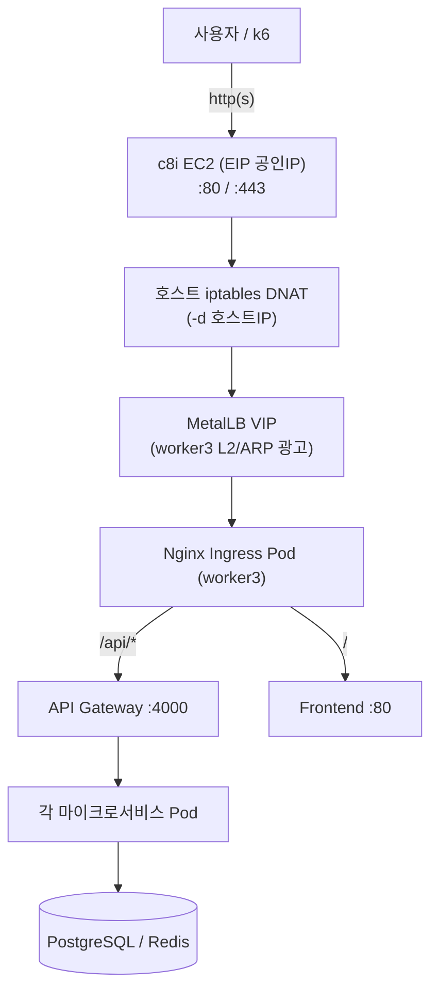
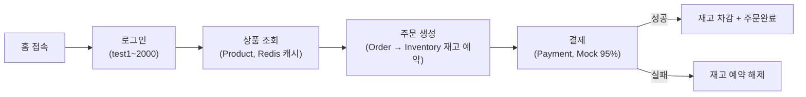
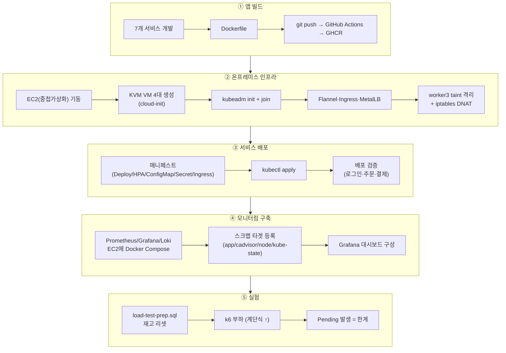
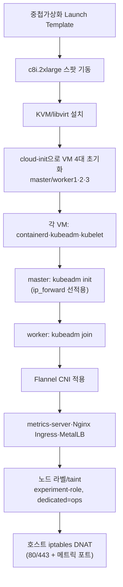
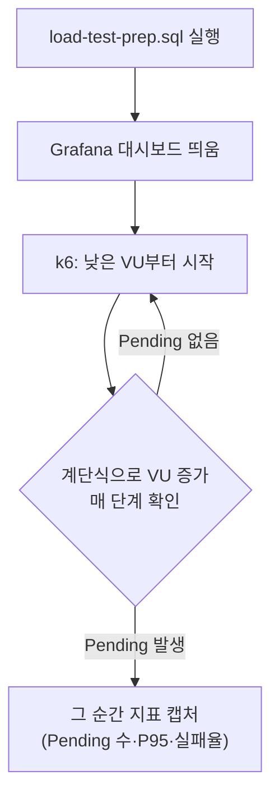
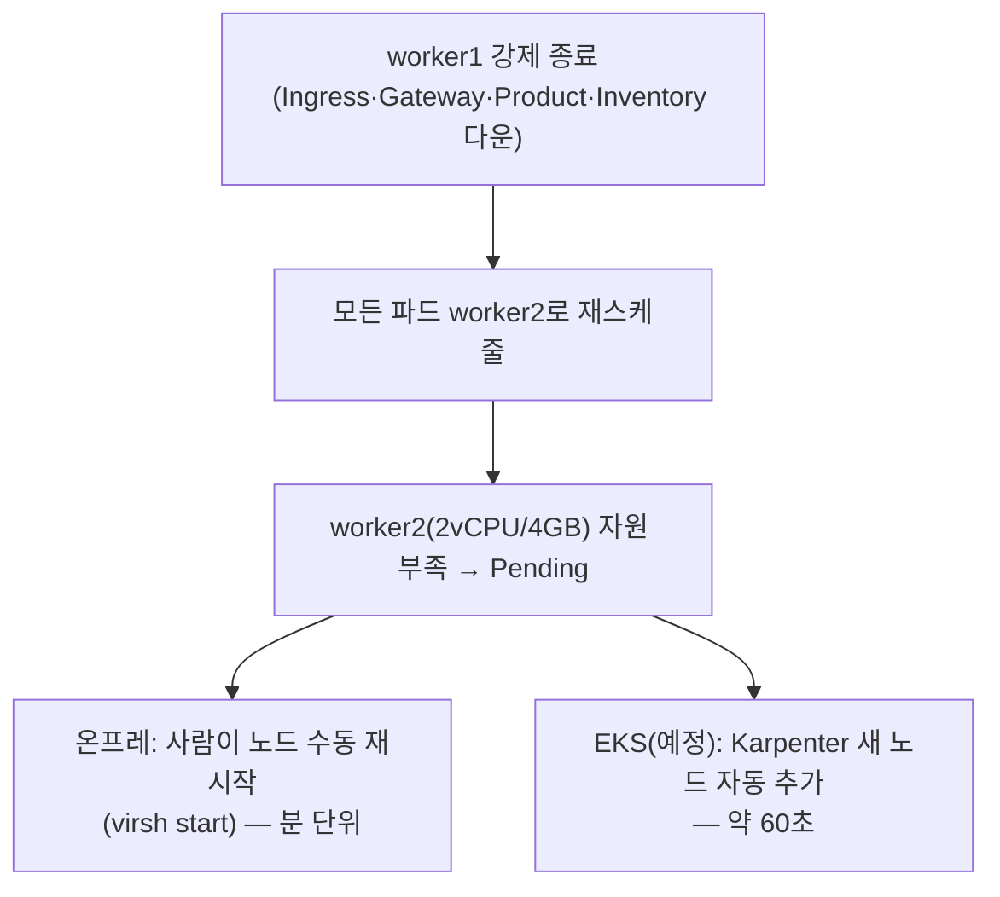

# 아키텍처 상세 — 트래픽 경로·작업 흐름·포트

전체 그림은 [루트 README](../README.md#인프라-구성도)의 구성도를 먼저 보고, 여기서 계층별 흐름을 깊게 봅니다.

## 사용자 요청 흐름 (트래픽 경로)

KVM VM에 공인 IP가 없어 EC2가 80/443을 받아 MetalLB VIP로 넘기는 **NAT 포워딩 홉이 한 번 더 있습니다**(EKS엔 없음 → 응답시간은 변화율%로 보정). Ingress 이후 라우팅은 `/api/*` → gateway, `/` → frontend로 나뉘고, gateway가 다시 각 서비스로 프록시합니다.

## 쇼핑 플로우 (앱 내부 흐름)

## 엔지니어 작업 흐름 (구축 → 배포 → 실험)

## 인프라 구축 상세 흐름

## 실험 측정 흐름 (한계 RPS 찾기)

| 한계 신호 | 확인 |
|---|---|
| **Pending 발생** ★ | `kubectl get pods --field-selector=status.phase=Pending` |
| 워커 CPU 90%+ | `kubectl top nodes` |
| HPA CURRENT=MAX | `kubectl get hpa` |

> 한계의 정의 = Pending Pod이 처음 뜨는 지점입니다.

## 노드 장애 시나리오 흐름 (시나리오 3 — 미실행)

> 시나리오 3(MTTR 측정)은 시간 제약으로 실행하지 못한 설계안입니다 — [실험 문서](experiments.md) 참고.

## 포트 정리

| 포트 | 위치 | 용도 |
|:---:|---|---|
| 80 / 443 | 온프레 EC2(iptables DNAT) | 외부 진입 → MetalLB VIP |
| 30080 | Nginx Ingress | NodePort 진입(양쪽 동일) |
| 4000~4005 | 앱 컨테이너 | gateway/product/inventory/order/payment/user |
| 30400~30404 | 앱 메트릭 | 서비스별 `/metrics` NodePort |
| 30800 | kube-state-metrics | 파드/노드/Pending 상태 |
| 39101~39103 | node_exporter | 워커별 NodePort |
| 38080/38081 | cAdvisor | worker1/2 (worker3 ops 노드는 toleration으로 추가 배치) |
| 5432 / 6379 | PostgreSQL / Redis | 공용 DB·캐시 EC2 |
| 9187 / 9121 | postgres_exporter / redis_exporter | DB·캐시 메트릭 |
| 9090 / 9091 | Prometheus(온프레) / Prometheus(EKS 전용) | EKS 쪽은 k6 remote-write 수신만 담당 |
| 3000 / 3100 / 3200 | Grafana / Loki / Tempo | 모니터링 스택, Tempo는 OTLP `4317`(gRPC)/`4318`(HTTP)도 사용 |
