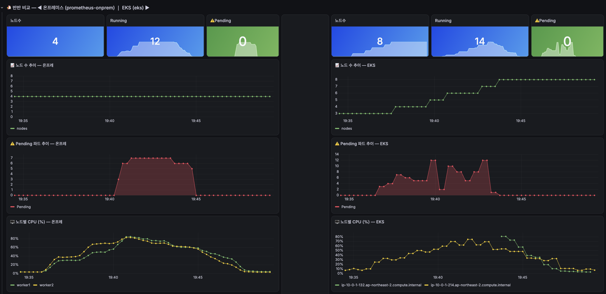

# 실험 — 안정 상태부터 한계까지, 점진 부하로 관찰하기

## 실험 프레임

앱·부하·설정을 전부 동일하게 맞추고, 딱 하나만 다르게 둡니다.

| 항목 | 온프레미스 | EKS |
|---|---|---|
| 파드 자동확장(HPA) | ✅ 동일 | ✅ 동일 |
| **노드 자동확장** ★핵심 | ❌ 없음(고정) | ✅ Karpenter |

핵심 독립변수는 "노드 자동확장"입니다. 온프레미스에서 Pending이 쌓이는 것은 실패가 아니라 측정 대상입니다.

## 공통 조건 (양쪽 동일)

| 항목 | 값 |
|---|---|
| 이미지 | GHCR 동일 SHA |
| 부하 도구 | k6(동일 스크립트) — [`../k6/README.md`](../k6/README.md) |
| 리소스 | request 100m/limit 500m, HPA target 70%(min2/max10) |
| 데이터 | 상품 20\~456종, 계정 test1\~2000(`Test1234!`) |
| 실험 전 | `load-test-prep.sql`로 DB 리셋(재고 사전 세팅으로 실험 오염 방지) |

부하 방식은 하이브리드입니다: request를 작게(100m) 둬서 HPA가 민감하게 발동하게 하고, k6 RPS를 크게 줘서 실제 CPU를 올립니다.

## 실험 방법 — 왜 점진(계단식) 부하인가

순간 스파이크로 때리면 시스템이 반응하기 전에 끝나 아무것도 안 보입니다. HPA가 파드를 늘리는 데 수십 초, Karpenter가 노드를 만드는 데 60\~90초가 걸리므로, **부하를 계단식으로 올리고 각 단계를 유지하면서** 시스템이 반응할 시간을 주고, 단계마다 무엇이 달라지는지를 관찰하는 방식을 택했습니다.

각 단계에서 관찰하는 전개는 이렇습니다:

```
안정 구간        →  HPA 반응        →  자원 포화           →  한계 (온프레) / 회복 (EKS)
Pending 0          파드 증설 시작       워커 CPU 80~90%       Pending 적체·P95 급등 / 노드 증설
에러 0%            replicas ↑          레이턴시 상승 시작      실패율 상승 / 해소
```

측정 지표: 노드 수 · Running/Pending 파드 수 · HPA replicas · 워커 CPU · P95 레이턴시 · k6 실패율. 전 과정을 Grafana에서 실시간 관찰하며 단계 전환점마다 캡처했습니다.

## 실행 ① — 온프레미스 한계 탐색 (0→2000 VU 계단식)

`scenario.js`(10웨이브 × 200 VU, 1분 간격 — 9분 시점 최대 2000 VU)로 안정 상태에서 시작해 한계까지 밀어붙였습니다.

단계별로 관찰된 변화:

1. **안정 구간**: Pending 0, 에러 0% — 평상시 수준의 부하에서는 온프레미스 고정 4노드도 충분히 버팁니다.
2. **HPA 반응**: 부하가 올라가자 CPU 70% 임계값을 넘긴 서비스부터 파드가 증설되기 시작 — gateway는 max(10)까지, product는 7개까지 확장([HPA 반응 캡처](../onprem/images/hpa-under-load.png)).
3. **자원 포화**: 워커 노드 CPU가 80\~90%까지 상승, Running 파드는 33개까지 증가.
4. **한계 도달**: 노드는 4개로 고정된 채 더 이상 파드를 받을 곳이 없어 **Pending 파드가 0→7개까지 적체**, P95 레이턴시 **6.54초**, k6 실패율 **최대 6%**. 이 지점이 "고정 자원의 한계"입니다.


별도의 1800 VU 실행에서는 결제 단계부터 실패율이 급증하는 패턴(p95 5.73초, `p(95)<3000` 임계값 초과로 테스트 실패 종료)도 확인했습니다 — 한계에 도달하면 쇼핑 플로우의 마지막 단계(결제)부터 무너집니다([`../k6/README.md`](../k6/README.md)).

## 실행 ② — 온프레미스 vs EKS 동시 비교 (최대 300 VU 웨이브)

`scenario-wave.js`(100명씩 3웨이브가 겹치며 최대 300 VU → 계단식 하강)를 **양쪽에 동일하게** 걸고, Grafana에 양쪽 Prometheus(`prometheus-onprem`/`eks`)를 동시에 붙인 반반 비교 대시보드로 관찰했습니다.

- **베이스라인**: 온프레 4노드/EKS 8노드 모두 Pending 0으로 안정.
- **부하 유지 구간**: 온프레는 노드가 4개로 고정된 채 **Pending 6\~7개가 수 분간 유지**. EKS는 Karpenter가 노드를 3→8개로 늘렸지만 **Pending이 최대 12개까지 두 차례 스파이크친 뒤에야 해소** — 자동확장이 있어도 노드 프로비저닝(60\~90초)이 끝날 때까지는 온프레와 똑같이 Pending이 쌓입니다.
- k6 자체 결과도 대칭적이지 않았습니다: 온프레 checks_failed 0.09% vs EKS 0.32% — 프로비저닝 구간에서는 EKS 실패율이 오히려 높은 순간도 있었습니다([비교 캡처](../k6/images/scenario-wave-300vu-eks.png)).




300 VU 전 과정(k6 패널 + 인프라 메트릭 패널)은 68초 영상으로 남겼습니다: [`videos/onprem-vs-eks-300vu-load-test.mp4`](videos/onprem-vs-eks-300vu-load-test.mp4)

## 설계했지만 실행하지 못한 것

- **노드 장애 복구(MTTR) 비교** — 500 RPS 유지 중 worker1을 강제 종료해 온프레(수동 복구, 분 단위)와 EKS(Karpenter 자동, 30\~60초)의 복구 시간을 재는 설계였으나 시간 제약으로 실행하지 못했습니다. 설계 흐름도는 [`architecture.md`](architecture.md#노드-장애-실험-설계-미실행)에 남겨뒀습니다. 이를 대비해 앱에 넣어둔 방어 설계(liveness/readiness 분리, order→inventory 타임아웃)는 [`../app/README.md`](../app/README.md)에 있습니다.

## 진행 상황

| 영역 | 상태 |
|---|---|
| 온프레미스 인프라(KVM k8s) 구축 | 완료 |
| 앱 7개 서비스 개발 · 이미지 빌드(GHCR) | 완료 |
| 서비스 배포 · HPA 작동 확인 | 완료 |
| 모니터링(Grafana 대시보드) | 완료 |
| 실행 ① — 온프레 점진 부하 한계 탐색 | **완료(한계 관측)** |
| 실행 ② — 온프레 vs EKS 동시 비교 | **완료** |
| 노드 장애 MTTR | 미실행(설계만) |

## 회고

- **"다 한 것 같은데" 함정**: AI 가이드를 따라가면 끝난 것처럼 보여도 설치 항목을 하나씩 빠뜨려 재설치를 반복하게 됨 — 결국 절차를 직접 문서로 고정하는 것이 재현성의 핵심이었습니다.
- **측정 환경은 설계의 일부**: 운영 파드가 실험 워커에 섞이면 "고정 자원의 순수 한계"를 측정할 수 없어, worker3를 taint로 격리해 실험 워커를 순수 부하 전용으로 만들었습니다.
- **실험은 조건이 90%**: 부하 세기뿐 아니라 유지 시간, 재고 사전 세팅 등을 맞추지 않으면 결과가 오염됩니다.
