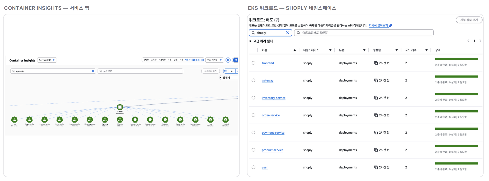
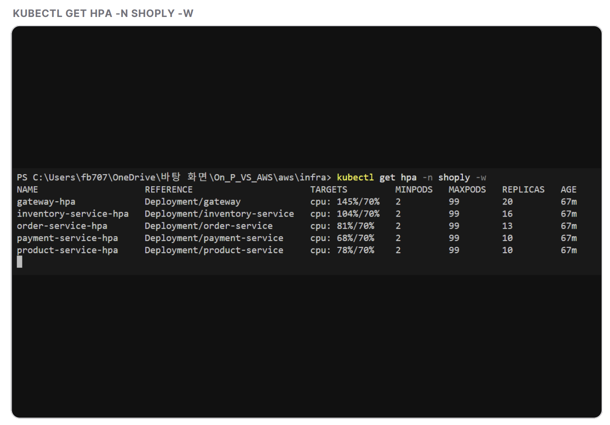
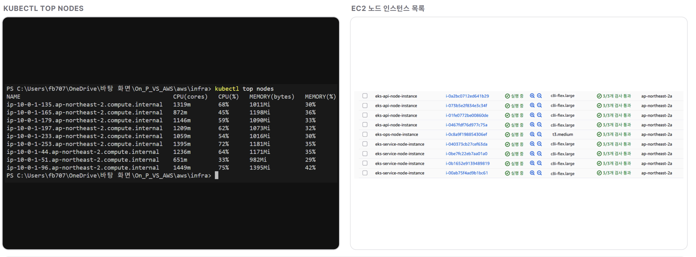
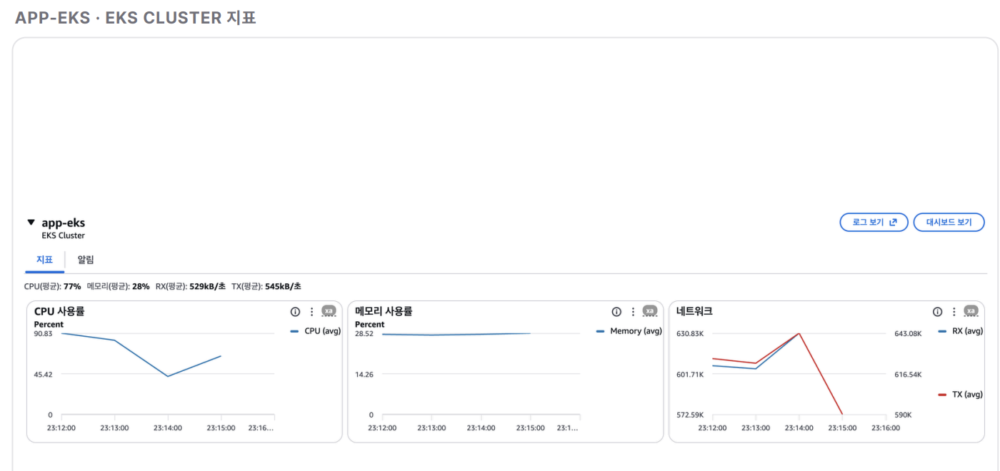

## AWS EKS 서비스 배포 · HPA 오토스케일링 · CloudWatch 모니터링 (담당: 김민수)

### 한 일

**1. ECR에 있는 이미지를 YAML로 배포**

각 서비스(frontend, gateway, product, inventory, order, payment, user)는 GitHub Actions를 통해 빌드된 이미지가 ECR에 미리 올라가 있고, 저는 이 이미지를 참조하는 Deployment/Service YAML 파일을 작성해서 `kubectl apply -f`로 EKS `shoply` 네임스페이스에 배포했습니다. YAML의 `image` 필드에 ECR 경로를 지정해두면, 배포 시 EKS가 해당 이미지를 ECR에서 그대로 가져와서 파드를 띄우는 구조입니다. 7개 서비스 모두 이 방식으로 배포했고, 전부 2 Pod Ready 상태로 정상 기동을 확인했습니다.

**2. HPA로 CPU 기준 오토스케일링 설정**

서비스별로 HPA YAML을 따로 작성해서, CPU 사용률이 70%를 넘으면 파드 개수를 자동으로 늘리도록 설정했습니다(`minReplicas: 2`, `maxReplicas: 99`). 이것도 마찬가지로 YAML 파일을 만들어서 `kubectl apply`로 클러스터에 적용했고, 부하 테스트를 걸었을 때 실제로 gateway는 145%까지 CPU가 올라가면서 20개 파드까지 자동으로 늘어나는 걸 확인했습니다.

**3. Karpenter 설치해서 노드 자동 확장 연동**

HPA가 파드를 늘려도, 그 파드를 올릴 노드 공간이 없으면 소용이 없기 때문에 Karpenter를 설치해서 노드 레벨 오토스케일링까지 연동했습니다. Karpenter는 NodePool이라는 리소스를 YAML로 정의해서 "어떤 스펙의 노드를 얼마나 늘릴 수 있는지"를 설정해두는 방식인데, 이렇게 해두면 파드가 늘어나서 기존 노드가 꽉 찼을 때 Karpenter가 이 상황을 감지해서 새 노드를 자동으로 띄워줍니다. 실제로 부하 테스트 중에 노드가 9개까지 자동으로 늘어나는 걸 확인했습니다.

**4. CloudWatch로 EKS·HPA·Karpenter가 잘 작동하는지 검증**

지금까지 설정한 것들(서비스 배포, HPA, Karpenter)이 실제로 의도대로 동작하는지 확인하기 위해 CloudWatch로 클러스터 전체의 CPU·메모리·네트워크 지표를 모니터링했습니다. 부하가 몰렸을 때 CPU가 최대 90.83%까지 올라가는 시점과 HPA가 파드를 늘리는 시점, Karpenter가 노드를 늘리는 시점이 서로 맞아떨어지는 걸 CloudWatch 그래프로 확인해서, 세 가지가 유기적으로 잘 작동하고 있다는 걸 검증했습니다.

---

### 1. 배포 현황

| 서비스 | 포트 | 역할 | Pod 수(기본) |
|---|---|---|---|
| gateway | 4000 | API 라우팅 진입점 | 2 |
| product | 4001 | 상품 조회 · Redis 캐싱 | 2 |
| inventory | 4002 | 재고 동시성 제어 | 2 |
| order | 4003 | 주문 생성 · 조회 | 2 |
| payment | 4004 | Mock 결제 처리 | 2 |
| user | 4005 | JWT 로그인 · 인증 | 2 |
| frontend | 80 | React + nginx UI | 2 |

7개 Deployment 전부 **정상 배포(2 Pod Ready, 실패 0)** 확인.

```bash
kubectl get deployment -n shoply
kubectl get pods -n shoply -o wide
```

**Deployment 매니페스트 예시 (order 서비스)**

```yaml
apiVersion: apps/v1
kind: Deployment
metadata:
  name: order
  namespace: shoply
spec:
  replicas: 2
  selector:
    matchLabels:
      app: order
  template:
    metadata:
      labels:
        app: order
    spec:
      containers:
        - name: order
          image: 367299441871.dkr.ecr.ap-northeast-2.amazonaws.com/app-order:latest
          ports:
            - containerPort: 4003
          resources:
            requests:
              cpu: "250m"
              memory: "256Mi"
            limits:
              cpu: "500m"
              memory: "512Mi"
---
apiVersion: v1
kind: Service
metadata:
  name: order
  namespace: shoply
spec:
  selector:
    app: order
  ports:
    - port: 4003
      targetPort: 4003
```

> 나머지 6개 서비스도 이미지 경로와 포트만 다르고 동일한 구조입니다.



---

### 2. HPA 오토스케일링

**설정값**: `minReplicas: 2` · `maxReplicas: 99` · `target CPU: 70%` · `scaleUp stabilizationWindowSeconds: 0` (즉시 반응)

```yaml
apiVersion: autoscaling/v2
kind: HorizontalPodAutoscaler
metadata:
  name: order-hpa
  namespace: shoply
spec:
  scaleTargetRef:
    apiVersion: apps/v1
    kind: Deployment
    name: order
  minReplicas: 2
  maxReplicas: 99
  metrics:
    - type: Resource
      resource:
        name: cpu
        target:
          type: Utilization
          averageUtilization: 70
  behavior:
    scaleUp:
      stabilizationWindowSeconds: 0
```

```bash
kubectl get hpa -n shoply -w
```

**부하 테스트 결과 (스케일 아웃)**

| 서비스 | CPU 사용률 | 목표 | Pod 수 |
|---|---|---|---|
| gateway | 145% | 70% | 20 |
| inventory | 104% | 70% | 16 |
| order | 81% | 70% | 13 |
| payment | 68% | 70% | 10 |
| product | 78% | 70% | 10 |

70% 임계값을 넘긴 서비스부터 자동으로 파드가 늘어나는 것을 확인. (온프레미스는 동일 시점에 노드 고정으로 Pending 적체)



---

### 3. Karpenter 노드 자동 확장

파드가 늘어나며 기존 노드가 꽉 차자, Karpenter가 이를 감지해 노드를 자동으로 추가.

```yaml
apiVersion: karpenter.sh/v1
kind: NodePool
metadata:
  name: default
spec:
  template:
    spec:
      requirements:
        - key: node.kubernetes.io/instance-type
          operator: In
          values: ["c8i-flex.large"]
      nodeClassRef:
        group: karpenter.k8s.aws
        kind: EC2NodeClass
        name: default
  limits:
    cpu: 1000
```

```bash
kubectl top nodes
```

**결과**: 노드 **9개** 전부 실행 중, **3/3 헬스체크 통과**. CPU 33%~75% 분산, 포화 노드 없음.



---

### 4. CloudWatch 모니터링

EKS 클러스터 전체 CPU/메모리/네트워크 지표를 CloudWatch로 확인.

| 지표 | 값 |
|---|---|
| CPU 평균 | 최대 90.83% (기저 45%) |
| 메모리 평균 | 28.08% (안정) |
| 네트워크 RX | 최대 607 kB/s |
| 네트워크 TX | 최대 626 kB/s |

**결론**: CPU가 실제 병목이고 메모리는 여유 → HPA를 **CPU 기준**으로 설계한 것이 데이터로 검증됨.



---

### 요약

같은 부하 조건에서 온프레미스는 노드 고정으로 Pending이 쌓였지만, EKS는 **HPA(파드 확장) + Karpenter(노드 확장)** 조합으로 서비스를 끊김 없이 유지했습니다.
