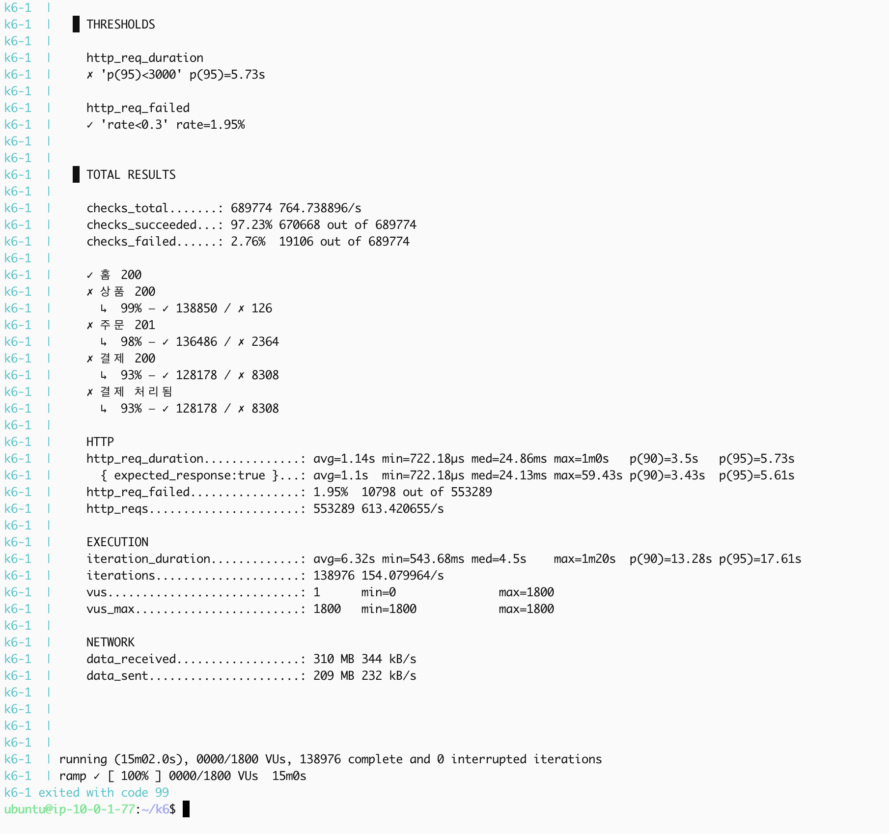
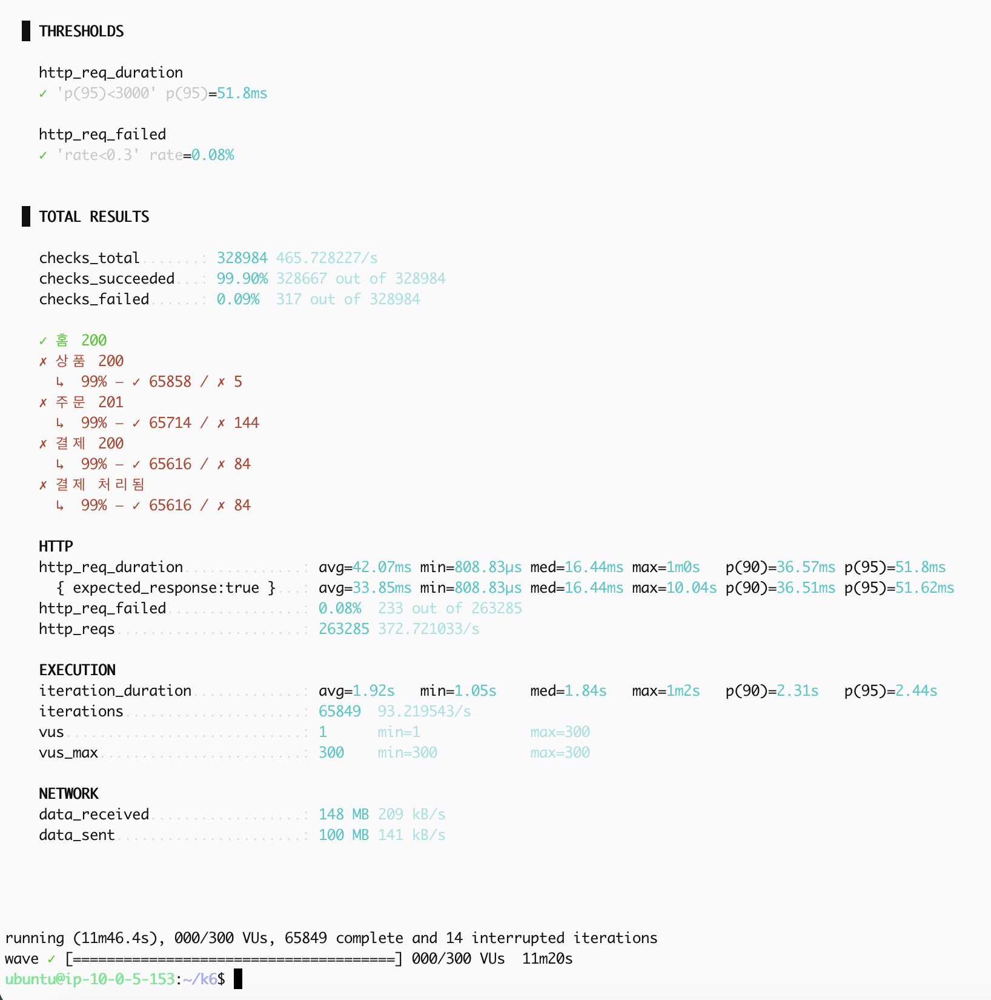
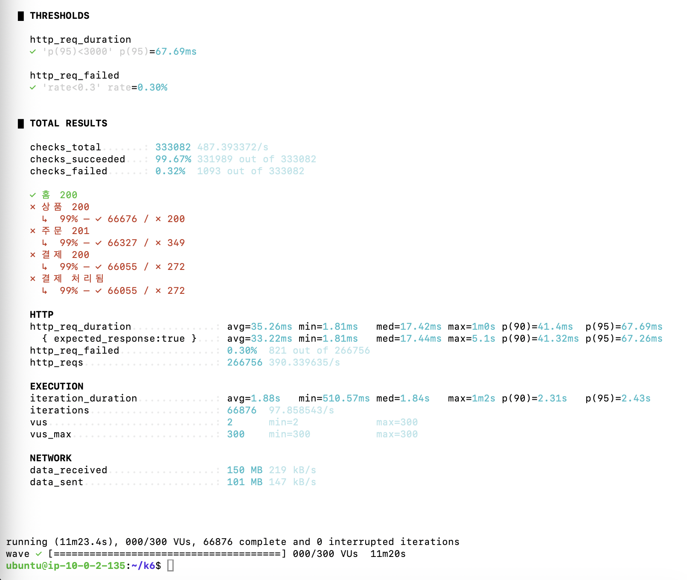

# k6 — 부하 테스트 시나리오

Shoply 앱에 실제 유저 흐름(홈→상품→주문→결제)을 시뮬레이션해 온프레미스/EKS의 한계 RPS와 HPA 반응을 관찰하기 위한 k6 스크립트입니다. 두 가지 시나리오가 있습니다.

| 스크립트 | 목적 | 부하 프로파일 |
|---|---|---|
| `scripts/scenario.js` | **노드 한계 탐색** — sleep 없이 최대 부하를 걸어 Pending이 뜨는 지점을 찾음 | 10웨이브 × 200명, 1분 간격 → 9분 시점 최대 2000명 동시 접속, 총 14분 |
| `scripts/scenario-wave.js` | **현실적 부하 재현** — think time을 넣어 실제 사용자 흐름에 가깝게, 웨이브가 겹치며 계단식으로 증감 | 100명씩 3웨이브가 2분 간격으로 시작, 각 7분 유지(20초 램프) → 4~7분 구간에 3웨이브가 겹쳐 최대 300명 동시 접속, 이후 300→200→100→0으로 계단식 하강 |

## 시나리오 흐름 (공통)

```
setup() - 테스트 시작 전 1회만 로그인 (test1@shoply.com) → JWT 토큰 발급
         → 모든 VU가 토큰 공유 (user 서비스 과부하 방지)

1. 홈페이지 접속              GET /
2. 상품 페이지 접속           GET /api/products/:id  (20개 상품 중 랜덤)
3. 무작위 사이즈 선택 후 주문  POST /api/orders
4. 배송지 입력 후 결제         POST /api/payments
```
> 2~4단계는 `Authorization: Bearer <token>` 헤더 포함. `scenario-wave.js`는 각 단계 사이에 `think()`(현실적 대기시간)를 추가로 넣습니다.

## 실행 결과 예시 (scenario.js, 1800 VUs)


> 55만여 건 요청, 결제 실패율 93%(재고 소진이 아니라 응답 타임아웃 기준 — p95 레이턴시 5.73초까지 치솟은 상태) — `http_req_duration p(95)<3000` 임계값을 초과해 테스트가 실패로 종료된 사례. 노드 자원이 한계에 도달했을 때 결제 단계부터 무너지는 걸 확인했습니다.

## 실행 결과 예시 (scenario-wave.js, 300 VUs — 온프레 vs EKS)

동일한 웨이브 부하(최대 300 VU)를 온프레·EKS 양쪽에 각각 걸어 k6 자체 결과를 비교했습니다. 온프레는 checks_failed 0.09%(65,849 iterations), EKS는 0.32%(66,876 iterations)로 EKS 쪽 실패율이 오히려 더 높게 나온 구간도 있었습니다 — Karpenter가 새 노드를 붙이는 동안에는 EKS도 순간적으로 여유가 없었기 때문입니다(Pending 추이는 [`../docs/experiments.md`](../docs/experiments.md) 참고).




## 테스트 전 재고 리셋

20개 상품 전체 재고를 9999로 초기화(재고 고갈로 인한 실험 오염 방지):
```bash
docker exec shoply-postgres psql -U shoply -d shoply -c "
TRUNCATE payments, order_items, orders RESTART IDENTITY CASCADE;
UPDATE inventory SET quantity = 9999, reserved = 0
WHERE product_id IN (
  '86f68efd-84f7-4630-9c50-4133f95cc67d','311362ee-0a57-4775-bd3f-648a732f5531',
  '5bb32797-8f48-43e9-a883-f610e0aa4641','7fe0aeac-7db0-4e6d-9c33-3086b563c6e4',
  '4f553095-66bd-49af-9737-8cb535fdee9f','8d23364d-58e9-4c89-a216-1c7dfb1623c5',
  '2c7088d7-d7d2-4cd3-9116-36df13064fa6','67881ad7-21e2-4c11-a5ac-61712c4d9f16',
  'd381b9a2-ae14-4e05-8aea-6c8520141b34','6bd56564-d9b5-4e4a-b38d-6c892f2b3a4f',
  'a3e37a1b-86cf-4391-aa71-7f453f9ee844','b66c42b2-1e9c-4591-b2d4-e1cf00a94b64',
  '018dc528-8d39-4129-8d70-73bd03edda26','70a6e8b4-a8ff-49c1-9047-d3a06e569464',
  '70454e30-c868-41c5-8e30-8608cce7d563','fe03aab0-8c29-4b8b-a286-52686420c959',
  '0fb80662-7c19-4ae9-8031-2e134fc52aca','3f2b6696-cc02-4769-a0f0-09a780ceeeca',
  'a0ad92e7-29e6-419c-a576-6c8c6234beb4','157192dd-1412-4afe-9ec7-cfdda556d25e'
);"
```

## 실행 방법

### Docker Compose 사용 (권장)

```bash
cd k6

# 온프레미스 타겟
BASE_URL=http://<온프레미스-공인IP> \
PROMETHEUS_RW_URL=http://<모니터링서버-사설IP>:9090/api/v1/write \
docker compose up

# EKS 타겟
BASE_URL=http://<EKS-ALB-URL> \
PROMETHEUS_RW_URL=http://<모니터링서버-사설IP>:9090/api/v1/write \
docker compose up
```
`docker-compose.yml`은 기본으로 `scripts/scenario.js`를 실행합니다. `scenario-wave.js`를 돌리려면 `command`를 바꾸거나 아래처럼 직접 실행합니다.

### Docker 직접 실행

```bash
docker run --rm -i \
  -v $(pwd)/scripts:/scripts \
  -e BASE_URL=http://<공인IP> \
  -e K6_PROMETHEUS_RW_SERVER_URL=http://<모니터링-사설IP>:9090/api/v1/write \
  --network host \
  grafana/k6 run --out experimental-prometheus-rw /scripts/scenario-wave.js
```

### EC2 부트스트랩

`k6.sh`(userdata)로 k6 실행용 EC2에 Docker를 설치하고 `~/k6/scripts` 작업 디렉토리를 준비합니다.

## Grafana 대시보드

Dashboards → Import → ID 입력

| ID | 이름 | 용도 |
|---|---|---|
| **18030** | k6 Prometheus - Native Histograms | RPS, 응답시간, 에러율 (권장) |
| **2587** | k6 Load Testing Results | 클래식 뷰 |

## API 라우팅 (게이트웨이 경유)

| 요청 경로 | 대상 서비스 |
|---|---|
| `GET /` | frontend |
| `POST /api/auth/login` | user-svc |
| `GET /api/products/:id` | product-svc |
| `POST /api/orders` | order-svc |
| `POST /api/payments` | payment-svc |

## 테스트 계정

- 이메일: `test1@shoply.com` ~ `test2000@shoply.com`
- 비밀번호: `Test1234!`
- 매 이터레이션마다 1~2000 중 랜덤 선택
