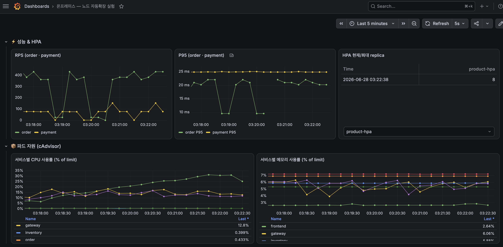
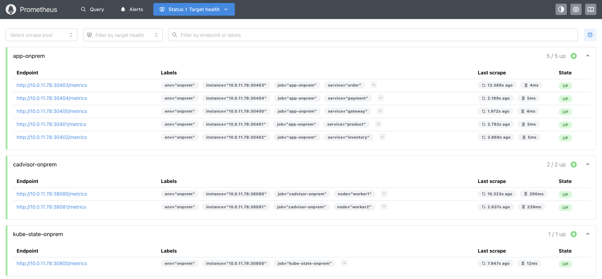
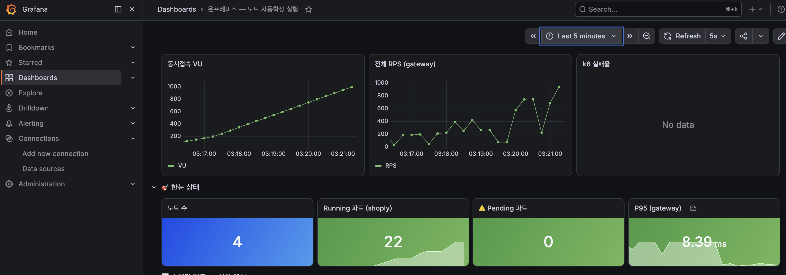

# monitoring — Prometheus / Grafana / Loki / Tempo

온프레미스와 EKS 양쪽 클러스터를 하나의 Grafana에서 비교할 수 있도록 구성한 관측 스택입니다. 별도 모니터링 EC2에 Docker Compose로 띄우며, 메트릭·로그·트레이스를 모두 수집합니다.


> "온프레미스 — 노드 자동확장 실험" 대시보드의 성능&HPA / 파드 자원(cAdvisor) 패널. RPS·P95 레이턴시·HPA replica 수·서비스별 CPU/메모리 사용률을 5초 주기로 갱신.

## 구성 요소

| 컴포넌트 | 이미지 | 역할 |
|---|---|---|
| Prometheus | `prom/prometheus` (`:9090`) | 온프레미스 클러스터 메트릭 스크랩 + k6 remote-write 수신 |
| Prometheus-EKS | `prom/prometheus` (`:9091`) | EKS 쪽은 인증 없이 자체 스크랩이 어려워, **k6 remote-write 수신 전용**으로만 사용 |
| Loki | `grafana/loki:2.9.8` (`:3100`) | 클러스터 로그·이벤트 저장(Promtail·event-exporter가 push) |
| Tempo | `grafana/tempo:2.6.1` (`:3200`, OTLP `:4317`/`:4318`) | 앱에서 온 OpenTelemetry 트레이스 저장 + 서비스그래프/스팬 메트릭 생성 |
| Grafana | `grafana/grafana` (`:3000`) | 위 4개를 데이터소스로 묶어 대시보드 제공 |

## Prometheus 스크랩 대상 (온프레)

`prometheus/prometheus-onprem.yml` 기준:

| job | 대상 |
|---|---|
| `app-onprem` | gateway/product/inventory/order/payment 메트릭 NodePort(30400~30404) |
| `cadvisor-onprem` | worker1/worker2 cAdvisor(38080/38081) — 파드별 CPU/메모리 |
| `node-onprem` | 워커 VM + 호스트 EC2 node_exporter |
| `kube-state-onprem` | kube-state-metrics(파드/Pending 상태) |


> app-onprem 5개, cadvisor-onprem 2개, kube-state-onprem 1개 타겟이 모두 UP인 상태.

## 로그 조회 (Loki)

클러스터의 앱 로그와 k8s 이벤트(Pending 사유 등)를 Grafana Explore에서 함께 조회할 수 있습니다.


> 위쪽은 shoply 앱 로그(nginx 액세스 로그), 아래쪽은 k8s 이벤트(gateway/product HPA 스케일 이벤트 등)를 같은 화면에서 시간순으로 확인.

## 트레이싱 연동 (Tempo) — 탐색적 시도

`app/` 브랜치 서비스들에 `tracing.js`로 OpenTelemetry를 붙여 OTLP(gRPC `:4317`/HTTP `:4318`)로 Tempo에 트레이스를 보내는 것까지는 구성해뒀습니다(Tempo가 서비스그래프/스팬 메트릭을 뽑아 Prometheus로 remote-write, Grafana Tempo 데이터소스에 `nodeGraph`/`tracesToLogsV2`/`tracesToMetrics` 연동 프로비저닝 완료).

다만 이건 "일단 붙여보고 쓸만한지 확인해보자"는 탐색 차원의 시도였고, 실제 비교 실험(시나리오 1/2/3)에서는 사용하지 않았습니다 — 온프레/EKS 비교에 필요한 지표는 Prometheus/Grafana 메트릭만으로 충분히 관찰 가능했기 때문입니다.

## 로컬/EC2 실행

```bash
cd monitoring
docker compose up -d
docker compose ps
```

- Prometheus: `http://<모니터링EC2-IP>:9090`
- Grafana: `http://<모니터링EC2-IP>:3000` (`admin` / `admin1234`)
- IP 변경(재구축) 후 설정만 반영: `curl -X POST http://localhost:9090/-/reload`

## 보안그룹 (모니터링 EC2)

| 방향 | 포트 | 소스/목적지 | 용도 |
|---|---|---|---|
| 인바운드 | 22, 9090, 3000 | Admin IP | SSH, Prometheus/Grafana UI |
| 아웃바운드 | 30400~30404 | 온프레 호스트 SG / EKS(0.0.0.0/0) | 앱 메트릭 NodePort |
| 아웃바운드 | 9100 | 온프레 호스트 SG / EKS(0.0.0.0/0) | node_exporter |
| 아웃바운드 | 9187, 9121 | PostgreSQL/Redis SG | DB/캐시 exporter |

## Grafana 대시보드 파일

| 파일 | 용도 |
|---|---|
| `grafana-dashboard-onprem.json` | 온프레미스 실험용 메인 대시보드 |
| `grafana-dashboard-eks.json` | EKS 쪽 대시보드 |
| `grafana-dashboard-compare.json` | 온프레 vs EKS 비교 뷰 — 노드 수·Running/Pending·노드별 CPU를 좌우로 나란히 표시 |
| `grafana-dashboard-recommend.json` / `grafana-dashboard-load.json` | Grafana 추천/부하 관련 대시보드 |


> `grafana-dashboard-compare.json`으로 300 VU 부하 중 캡처 — 왼쪽 온프레는 Pending이 쌓인 채 유지, 오른쪽 EKS는 노드가 늘어나지만 Pending도 함께 스파이크쳤다가 뒤늦게 해소됨.

## 트러블슈팅에서 배운 것

- **node_exporter/kube-state-metrics가 "에러 없이 조용히 안 떠 있는" 경우가 있습니다** — Prometheus 타겟 화면에서 down으로만 보이고 별도 알림이 없어 놓치기 쉽습니다. 재구축 후엔 [`onprem/TROUBLESHOOTING.md`](../onprem/TROUBLESHOOTING.md#16-prometheus-타겟-down--node_exporter--kube-state-metrics-설치-누락)의 체크리스트대로 확인합니다.
- **호스트 DNAT를 거치는 타겟(cadvisor/kube-state/app)과 EC2 직결 타겟(DB/Redis)을 구분해서 진단**해야 합니다 — 전자만 죽으면 클러스터가 아니라 호스트 포워딩(ip_forward/DNAT) 문제입니다([`onprem/TROUBLESHOOTING.md` 17번](../onprem/TROUBLESHOOTING.md#17-모니터링-타겟-down--호스트-포워딩-ip_forward--실행-위치--sg-)).
- **모니터링 EC2를 새로 띄우면 Promtail/event-exporter의 push 대상 IP도 갱신해야 합니다** — 안 하면 로그가 조용히 사라집니다([`onprem/BACKUP-RESTORE.md`](../onprem/BACKUP-RESTORE.md) 6-1단계).
