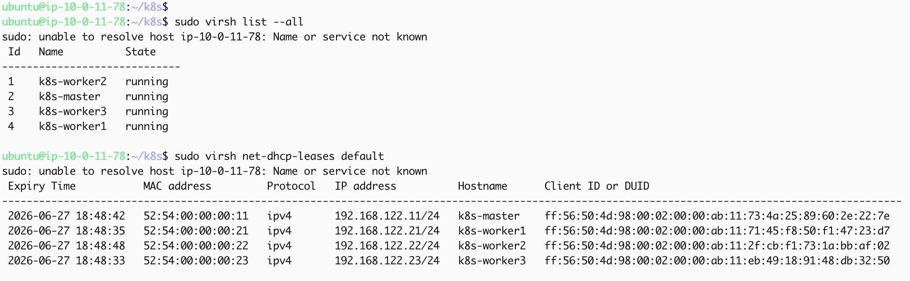
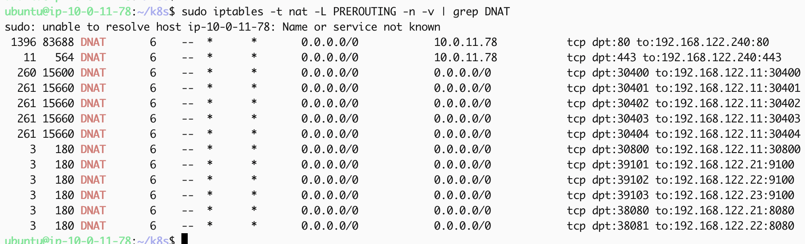
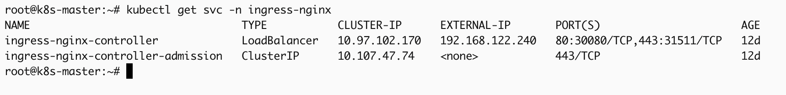
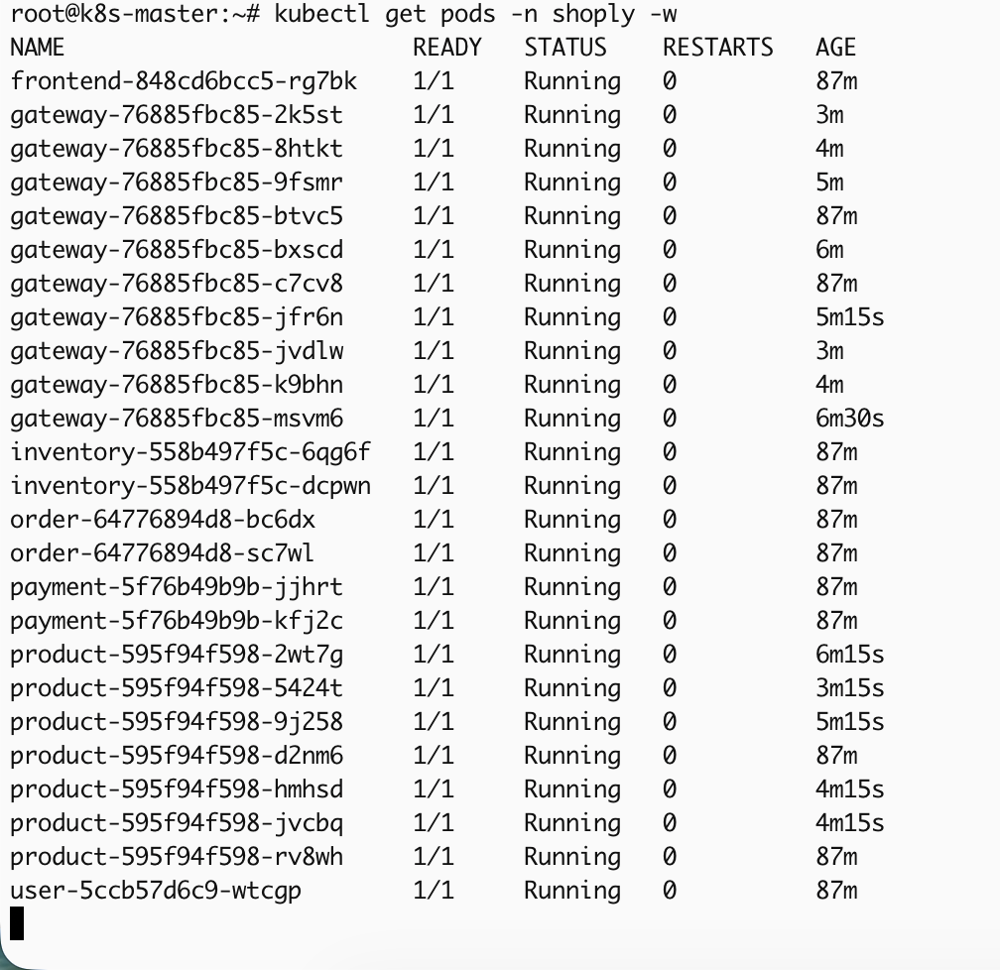
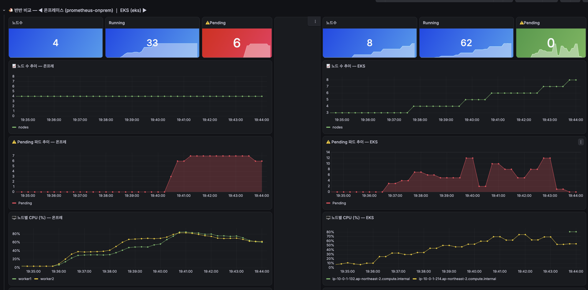

# onprem — 온프레미스 인프라 구축·배포·운영

AWS EC2 위에 **KVM 가상머신**으로 물리 온프레미스 k8s를 재현한 담당 영역입니다. 앱 코드(`app/` 브랜치)를 실제로 띄우고, AWS EKS와 비교할 "고정 자원" 쪽 인프라를 처음부터 끝까지 구축·운영했습니다.

> VPC 안 호스트 EC2에서 KVM으로 master/worker1/worker2(실험 노드)/worker3(ops, 모니터링·ingress 전용) 4대를 띄우고, 호스트 iptables DNAT로 외부 트래픽을 클러스터로 포워딩합니다. DB(PostgreSQL)·Redis·모니터링(Grafana/Prometheus)은 각각 별도 EC2.

## EC2 구성

| EC2 | 역할 |
|---|---|
| c8i.2xlarge (스팟) | k8s 호스트 — KVM VM 4대 + 호스트 Nginx/iptables |
| PostgreSQL EC2 | DB (Docker, PostgreSQL 16, `max_connections=300`) |
| Redis EC2 | 캐시 (Docker, Redis 7) |

## KVM 가상머신 구축 — 실제 과정(시행착오 포함)

| 단계 | 내용 |
|---|---|
| 인스턴스 | c8i-flex.2xlarge **스팟** — 인프라 검증 후 끌 거라 온디맨드 불필요 |
| OS | Ubuntu **24.04** — 22.04는 스팟 가용성이 없어서 24.04로 |
| 첫 시도 실패 | c8i-flex인데 KVM 가상화가 기본 비활성 → 처음엔 **LXD 컨테이너**로 구성(서비스·부하는 잘 돌아감) |
| 원인 파악 | "중첩가상화 되는 인스턴스인데 왜 안 되지?" → **중첩가상화를 명시적으로 활성화**해야 한다는 걸 확인 |
| 활성화 방법 | 스팟 요청 페이지엔 옵션이 없어 **launch template를 만들어** 중첩가상화를 켜니 KVM이 작동 |
| VM 생성 | cloud-init으로 VM 4대 초기화(master/worker1/worker2/worker3, 각 2vCPU/4GB) |
| k8s 설치 | containerd·kubeadm/kubelet/kubectl을 **직접 하나씩 설치**(자동화 없이), master `kubeadm init` + worker `join` |
| 삽질 | 설치 항목을 하나씩 빠뜨려 재설치 반복 — 다음날 정리 파일에도 누락 발견돼 다시 설치+정리 |

> **교훈**: "다 한 것 같은데 하나씩 빼먹어서" 설치→재설치를 여러 번 반복했습니다. 결국 설치 절차를 직접 문서(`TROUBLESHOOTING.md`, `BACKUP-RESTORE.md`)로 고정해서 재현 가능하게 만들었습니다.

> 4개 노드(master + worker1/2/3) 모두 Ready, Ubuntu 24.04.4 + containerd 2.2.4.

> KVM VM 4대가 모두 `running` 상태. MAC 주소를 고정해 DHCP 임대 IP가 재부팅 후에도 바뀌지 않도록 했습니다.

## k8s 클러스터 구성

| 단계 | 실제 |
|---|---|
| init | master에서 `kubeadm init --pod-network-cidr=10.244.0.0/16 --apiserver-advertise-address=$MASTER_IP` |
| join | worker 3대 `kubeadm join <MASTER>:6443 --token ...` |
| CNI | Flannel **v0.26.7**(GitHub 릴리스로 apply) |
| 부가 | metrics-server(`--kubelet-insecure-tls`), Nginx Ingress(helm, NodePort) |
| 노드 라벨 | `experiment-role=worker1/worker2`로 파드를 노드별 고정 배치(affinity) + 관찰 편의 |
| 노드 격리 | worker3에 `dedicated=ops:NoSchedule` taint — 모니터링·ingress 등 운영성 파드를 실험 노드(worker1/2)에서 분리해, 실험 워커를 순수 "고정 자원"으로 유지(측정 신뢰도 확보) |

## 네트워크

> 호스트 EC2의 PREROUTING DNAT 규칙 — 80/443은 MetalLB VIP로, 앱/노드 메트릭 포트(30400~30404, 39101~39103, 38080~38081)는 각 VM으로 포워딩됩니다.

> MetalLB가 ingress-nginx-controller 서비스에 EXTERNAL-IP(192.168.122.240)를 할당 — 이 VIP로 호스트 DNAT가 트래픽을 넘깁니다.

- **EC2 iptables DNAT** — KVM VM은 공인 IP가 없어 `EC2:30080 → DNAT → master_VM:30080` 식으로 호스트가 NAT 포워딩합니다.
- **iptables DNAT 포워딩** — VM 내부 NodePort 메트릭을 외부 Prometheus로 노출(30400~30404, 30800, 39101/39102 등).
- 스크립트: [`scripts/host-network.sh`](scripts/host-network.sh) — `ip_forward`·DNAT·FORWARD를 호스트 사설IP 자동 감지로 한 번에 설정.

## 서비스 배포 — k8s 매니페스트

매니페스트는 AI 도움을 받아 구조를 잡고 값을 조정했습니다. 실제 배포는 이미지 pull·CrashLoop·Pending 등 큰 이슈 없이 진행됐지만, **ConfigMap에 DB/Redis 사설 IP를 넣어야 한다는 걸 처음엔 몰라서** 빠뜨렸다가, 파드가 DB에 못 붙는 걸 보고서야 깨닫고 그 이후부터 ConfigMap에 사설 IP를 채워 배포했습니다.

| 리소스 | 역할 |
|---|---|
| Deployment | 파드 정의(이미지, 리소스, 프로브, affinity) |
| Service(ClusterIP) | 내부 통신 |
| Service(NodePort) | 메트릭 scrape 노출 |
| HPA | 자동 확장(5개: gateway/product/inventory/order/payment) |
| ConfigMap | DB/Redis 호스트 등 환경값 |
| Secret | DB 비번, JWT, GHCR 인증 |
| Ingress | Nginx 경로 라우팅(`/api`→gateway, `/`→frontend) |

### 확정 설정값

| 항목 | 값 | 이유 |
|---|---|---|
| resource | request **100m** / limit **500m**(frontend 50m/200m) | request를 작게 둬서 HPA가 민감하게 발동하도록 |
| HPA | target CPU **70%**, min **2** / max **10**, 60초당 +2개 | 노드 자원 한계(Pending)까지 파드가 늘어나는 걸 관찰하기 위해 상한을 넉넉히 잡음 |
| 배치 | soft nodeAffinity(worker1/worker2) | 초기 고정 배치, HPA로 늘어난 파드는 자유 배치 |
| 인증 | GHCR imagePullSecret | private 이미지 pull |

> **HPA 조정 시행착오**: 처음엔 각 서비스 replicas 2개 + HPA max를 낮게 제한해뒀습니다. 그런데 부하를 줘도 파드가 많이 안 늘고 CPU·메모리도 크게 안 올랐습니다. → replicas 1개 시작 + max를 넉넉히 풀어서, 노드 한계까지 파드가 늘어나 Pending이 관찰되도록 바꿨습니다(max를 낮게 제한하면 노드가 안 터져서 "고정 자원의 한계"를 못 보여주기 때문).

자세한 배포 순서·체크리스트는 [`k8s/README.md`](k8s/README.md) 참고.

## 부하 실험에서 확인한 동작

> 부하가 걸린 상태에서 `kubectl get hpa`: gateway는 CPU 66%로 replicas 10(max)까지 확장, product는 61%로 7개까지 확장. 트래픽이 적은 inventory/order/payment는 min(2)에 머무름.

> 실제로 gateway/product 파드 수가 늘어나는 모습(생성된 지 몇 분 안 된 파드들이 다수 보임) — HPA가 의도대로 작동함을 확인.

**EKS와의 직접 비교**: Grafana에 온프레·EKS 양쪽 Prometheus를 동시에 붙인 반반 비교 대시보드로 같은 부하(최대 300 VU)를 걸어봤습니다. 온프레는 노드 4개 고정 상태라 Pending이 6~7개까지 쌓여 수 분간 유지된 반면, EKS는 Karpenter가 노드를 3→8개로 늘렸음에도 Pending이 최대 12개까지 두 차례 스파이크친 뒤에야 해소됐습니다 — 자동확장이 있어도 노드 프로비저닝 시간(60~90초) 동안은 Pending이 쌓인다는 걸 눈으로 확인한 셈입니다. 자세한 수치·부하 테스트 영상은 [`../docs/experiments.md`](../docs/experiments.md) 참고.

## 트러블슈팅 & 복구

클러스터를 여러 번 재구축하면서 겪은 문제들을 전부 기록해뒀습니다.

- [`TROUBLESHOOTING.md`](TROUBLESHOOTING.md) — 네트워크·kubeadm·flannel·apiserver·ingress 등 구축 과정에서 마주친 문제 20가지(증상→원인→해결)
- [`BACKUP-RESTORE.md`](BACKUP-RESTORE.md) — 스팟 호스트 EC2가 회수될 때를 대비한 AMI 백업/복원 절차, 그리고 복원 후 매번 반복되는 삽질(br_netfilter, DB/Redis IP 갱신 등)을 "무삽질"로 만든 영구화 방법

가장 인상적이었던 건 [13번 — kube-apiserver CrashLoopBackOff](TROUBLESHOOTING.md#13-kube-apiserver-crashloopbackoff--loopback127001-방화벽-drop-)입니다. `connection refused`가 아니라 `i/o timeout`이 뜨는 패턴으로 "방화벽이 loopback 트래픽까지 DROP하고 있다"는 걸 역추적해서 찾아냈습니다.

## 스크립트

| 스크립트 | 역할 |
|---|---|
| [`scripts/host-network.sh`](scripts/host-network.sh) | 호스트 EC2에서 실행 — ip_forward·DNAT·FORWARD를 사설IP 자동 감지로 설정 |
| [`scripts/restore-cluster.sh`](scripts/restore-cluster.sh) | 새 EC2에서 실행 — KVM 설치 + VM 복원 |

## 백업/복원 요약

VM 정지 → qcow2+XML tar → 보관 → 새 EC2에서 `restore-cluster.sh`. AMI 방식(월 $2.5~3.3)과 qcow2 수동 백업(무료) 두 가지를 모두 검토했고, 자세한 절차는 [`BACKUP-RESTORE.md`](BACKUP-RESTORE.md)에 있습니다. 두 방식 모두 **VM IP 고정(MAC 고정)이 전제**입니다 — 안 하면 복원 후 클러스터 인증서/kubeconfig가 깨집니다.
